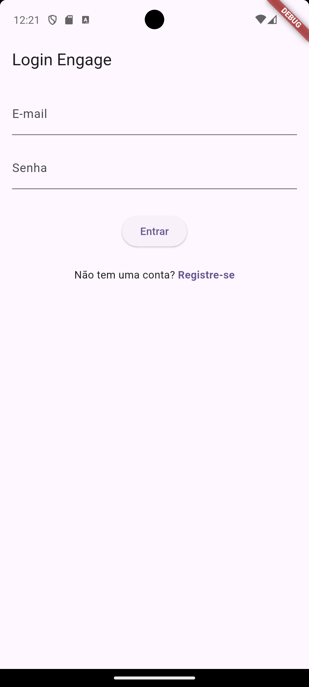
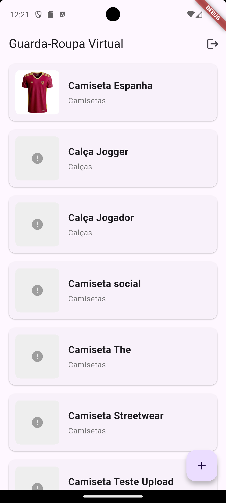
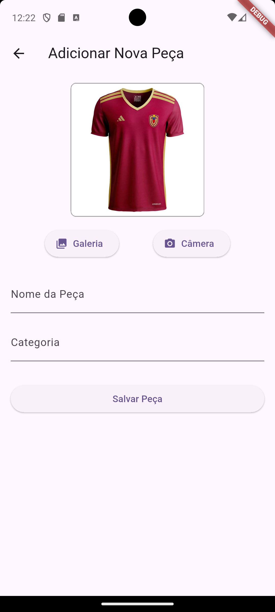

# Engage App (Flutter Frontend)

<p align="center">
  <strong>Aplicativo móvel multiplataforma para um guarda-roupa virtual, construído com Flutter e uma arquitetura limpa.</strong>
</p>

<p align="center">
  
  
  
  
</p>

> Este é o frontend do projeto **Engage**, um cliente móvel que consome a **[Engage API](https://github.com/athomasmariano/fpengage-backend)**.

## 📱 Telas Principais

| Login | Guarda-Roupa | Adicionar Peça |
| :---: | :---: | :---: |
|  |  |  |

### Fluxo em Ação

<p align="center">
  
</p>


## ✨ Features

-   **Fluxo de Autenticação Completo:** Telas de Login e Registro com validação de formulário.
-   **Gerenciamento de Sessão Seguro:** O token JWT retornado pela API é armazenado de forma segura no dispositivo usando `flutter_secure_storage`.
-   **Guarda-Roupa Virtual:** Visualização em lista das peças de roupa do usuário. A tela reage dinamicamente aos estados de carregamento, sucesso, erro ou lista vazia.
-   **Adicionar Nova Peça:** Funcionalidade completa para adicionar uma nova peça, incluindo:
    -   **Seleção de Imagem:** Acesso à câmera ou galeria do celular usando o pacote `image_picker`.
    -   **Preview da Imagem:** Exibição da foto selecionada antes do upload.
    -   **Upload de Arquivo:** Envio da imagem para o backend como `multipart/form-data`.
-   **Navegação Robusta:** Gerenciamento de rotas e estado de navegação após login e logout.

## 🏗️ Arquitetura e Gerenciamento de Estado

O aplicativo foi construído seguindo uma **arquitetura limpa** e escalável, com uma estrutura de pastas **Feature-First**.

-   **Camada de Dados (Data Layer):**
    -   **Repository:** Classes (`AuthRepository`, `ClothingRepository`) responsáveis pela comunicação com a API e manipulação dos dados.
-   **Camada de Lógica (Logic Layer):**
    -   **Cubit (`flutter_bloc`):** Gerencia o estado de cada feature (`AuthCubit`, `ClothingCubit`), separando a lógica de negócio da UI.
-   **Camada de Apresentação (Presentation Layer):**
    -   **View:** Widgets que reagem às mudanças de estado emitidas pelos Cubits para se reconstruírem de forma eficiente.

O **gerenciamento de dependências** é feito de forma explícita utilizando `RepositoryProvider` e `BlocProvider`, garantindo que as camadas sejam desacopladas e facilmente testáveis.

## 📚 Pacotes Principais Utilizados

| Pacote | Propósito |
| :--- | :--- |
| **`flutter_bloc`** | Gerenciamento de estado reativo e previsível. |
| **`dio`** | Cliente HTTP poderoso para comunicação com a API, configurado com Interceptors para autenticação automática. |
| **`image_picker`** | Acesso nativo à câmera e galeria de fotos do dispositivo. |
| **`flutter_secure_storage`** | Armazenamento seguro e criptografado do token de autenticação. |
| **`equatable`** | Simplifica a comparação de objetos de estado para otimizar reconstruções da UI. |

## 🚀 Como Executar o Projeto

### Pré-requisitos
-   [Flutter SDK](https://flutter.dev/docs/get-started/install) (versão 3.x ou superior)
-   Um emulador Android configurado ou um dispositivo físico.
-   O [**backend (Engage API)**](https://github.com/athomasmariano/fpengage-backend) deve estar rodando localmente.

### Passos
1.  **Clone o repositório:**
    ```bash
    git clone [https://github.com/athomasmariano/fpengage-app.git](https://github.com/athomasmariano/fpengage-app.git)
    cd fpengage-app
    ```
2.  **Configure o IP do Backend:**
    Este é um passo crucial. O app precisa saber o endereço do seu backend na sua rede local.
    -   Abra o arquivo `lib/core/api/api_client.dart`.
    -   Encontre a linha `baseUrl: 'http://10.0.2.2:3000'`.
    -   Se estiver usando o emulador padrão do Android, mantenha `10.0.2.2`. Se estiver usando um celular físico, troque pelo endereço de IP da sua máquina (que você pode encontrar com `ipconfig` no Windows).

3.  **Instale as dependências:**
    ```bash
    flutter pub get
    ```

4.  **Execute o aplicativo:**
    ```bash
    flutter run
    ```

## 🗺️ Roadmap do Projeto

-   [ ] **Provador Virtual com AR:** O grande próximo passo! Implementar uma nova tela que utilize a câmera e um pacote de Realidade Aumentada para sobrepor as imagens das roupas.
-   [ ] **CRUD Completo:** Adicionar funcionalidades para editar e deletar peças de roupa.
-   [ ] **Melhorias de UI/UX:**
    -   Transformar a `ListView` do guarda-roupa em uma `GridView` para melhor visualização.
    -   Adicionar animações de transição e feedback visual.
    -   Criar uma tela de perfil de usuário.
-   [ ] **Login Automático:** Ao iniciar o app, verificar se um token válido já existe e navegar diretamente para a `HomeScreen`.

## ✍️ Autor

Projeto idealizado e desenvolvido por Arthur Thomas Mariano.

[](https://www.linkedin.com/in/arthur-thomas-941a97234/)
[](https://github.com/athomasmariano)
[](mailto:athomasmariano@gmail.com)
